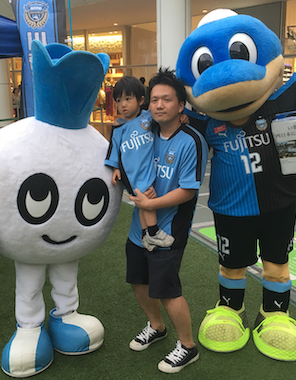

  <b>Masayuki Ioki (伊尾木 将之)</b> 
  kikainekox[at]gmail.com  
   
  

Masayuki Ioki (伊尾木 将之) is a
- Supporter of [Kawasaki Frontale](https://www.frontale.co.jp/).
- Researcher of Food Culture.
- Software engineer for 16+ years.
- Contributor of many articles to NikkeiBP for 12+ years.
- Student of Physics.

## Projects
- Edo Recipes ([link](https://cookpad.com/kitchen/14604664))

## Career
- Cookpad Inc. (2014 - Present)
  - Belongs to Research and Development
  - Software engineer (Ruby, Python, Golang ...)
  - Product owner of `the Cooking School Service`
- Officer of the Japan Society of Home Economics Division of Food Culture (2015 - Present) ([link](http://www.js-foodculture.org/))
- IBM Japan (2003 - 2014)
  - SE, Project manager

## Education
- Tokyo Institute of Technology (2009 - 2014)
  - Dept. of Mathematical and Computing Sciences
  - Finished Ph.D. program without a degree ;-(
- Osaka University (2001 - 2003)
  - Master of Physics
- Kobe University (1997 - 2001)
  - Bachelor of Physics

## Publications
### Papers (Selected)
- Meat Dishes for New Year's Day from Recipe Search Data (レシピ検索データに現れる牛豚を使った新正月料理) [(link)](https://ci.nii.ac.jp/naid/40021026570)
- Survey on New Year's Occasion and Cuisine Performed at the Beginning and End of the Year (正月行事と食 : 年末年始の実態調査) [(link)](https://ci.nii.ac.jp/naid/40021785425)
- An Aspect-oriented Language for Optimization over Two Method Calls (2つのメソッド呼び出しに関わる最適化を可能にするアスペクト指向言語) [(link)](https://ci.nii.ac.jp/naid/110008616677)

### Books & Articles, Interviews (Selected)
- クックパッドデータから読み解く食卓の科学 ([link](https://www.amazon.co.jp/dp/4785505206/))
- 実践 Ruby on Rails Webプログラミング入門 ([link](https://www.amazon.co.jp/dp/4881665413))
- 日経ソフトウエア ([link](https://www.nikkeibpm.co.jp/item/nsw/756/saishin.html))
  - I have written many articles for 12+ years.
  - about Ruby, Java, Javascript, Python, Gauche, GPGPU, VUI and so on.
- Ruby Magazine (るびま) ([link](https://magazine.rubyist.net/articles/0020/0020-Hotlinks.html))
- 1日5合のごはんを食べていた。食を楽しむ文化が生まれた江戸食の世界 ([link](https://www.mylohas.net/2018/05/167531edo.html))
- Eat Like it’s 1830 at This Tokyo Restaurant. ([link](https://heated.medium.com/eat-like-its-1830-at-this-tokyo-restaurant-710852fe969f))
- 曖昧なレシピを調理家電が読める形式に、クックパッドが開発状況を発表 ([link](https://tech.nikkeibp.co.jp/atcl/nxt/news/18/04267/?ST=nnm))
- 探検バクモン (TV, NHK)
  - Food Culture and Smart Kitchen.

### Presentations (Selected)
- I will update this.

### Competitive funds
- IPA MITOU (未踏プロジェクト) 2006 ([link](https://www.ipa.go.jp/jinzai/esp/2006mito1/gaiyou/4-24.html))

### Patents
I got 17 opened patents at cookpad and IBM.
